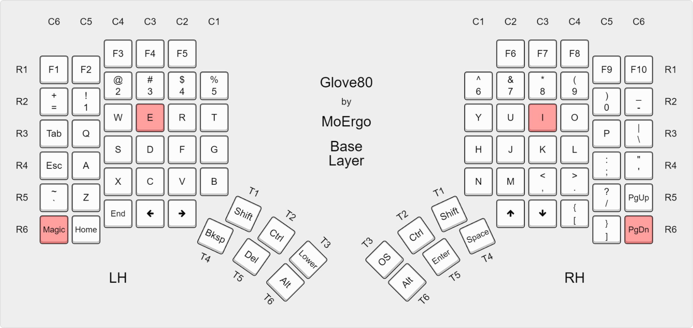

# Glove80 ZMK Configuration Generator

This is my personal configuration system for my Glove80 keyboard. I built this to manage my own keymap and generate ZMK firmware with the features I need. Feel free to fork it or use it as inspiration for your own setup, but keep in mind it's tailored to my specific workflow and preferences. Your mileage may vary! 

I'm quite curious about your feedback - reach out to me here on GitHub or on Twitter [@shllg](https://twitter.com/shllg).

## Motivation

The [Glove80 Editor](https://my.glove80.com/#/edit) is awesome and definitely the right starting point when you customize your Glove80 keyboard - like I did. Along the way I found a couple of things that are not possible with the web editor but I wanted to have:

1. Per-key RGB for each layer to have a visual indicator when switching. Especially useful for my character layer.
2. Better home row mods by using the `global-quick-tap-ms` setting which didn't work for me in the editor


## Why darknao's ZMK Fork?

The compile script uses [darknao's ZMK fork](https://github.com/darknao/zmk) (branch `rgb-layer-24.12`) instead of the official ZMK firmware. This is necessary because the Glove80 web interface exports keymaps with advanced features that aren't available in standard ZMK:

- **RGB_STATUS and per-key RGB control**: The web interface generates RGB commands like `RGB_STATUS` that only this fork understands
- **Enhanced mouse support**: Smooth scrolling and advanced mouse key features
- **Layer-based RGB effects**: Change LED colors based on active layers
- **Community features**: Additional behaviors and macros from the Glove80 community

Without this fork, the firmware would fail to compile with syntax errors on RGB commands and missing mouse features.

## Overview

This TypeScript-based build system takes a JSON configuration and generates:
- ZMK firmware files (`.uf2`) ready to flash
- Visual keyboard diagrams (SVG/PDF)
- YAML for keymap-drawer visualization

## Quick Start

```bash
# Install dependencies
pnpm install

# Build keymap from config
pnpm build

# Compile firmware (requires Docker)
pnpm compile

# Flash the firmware files from firmware/ directory to your keyboard
```

## Project Structure

```
config/         # Layout configuration
  layout.json   # Define your layers and keys
  led.json      # LED settings

out/            # Generated files
  keymap.dtsi   # ZMK device tree
  keymap.yaml   # For visualization
  keymap.svg    # Visual diagram

firmware/       # Compiled firmware
  glove80_left.uf2
  glove80_right.uf2

templates/      # ZMK template from Glove80 web interface
src/            # TypeScript build system
```

## Workflow

(TODO: Update workflow and eventually opt out of editor export. I think that's not a good strategy. Maybe I can prepare a glove80 dtsi to json export to get an initial starting point based on existing config?)

1. Export your keymap from the [Glove80 Layout Editor](https://my.glove80.com)
2. Save as `templates/keymap.template.dtsi`
3. Edit `config/layout.json` with your layout
4. Run `pnpm build && pnpm compile`
5. Flash the `.uf2` files to your keyboard

## Requirements

- Node.js & pnpm
- Docker (for firmware compilation)
- keymap-drawer (optional, for diagrams): `pip install keymap-drawer`
- Inkscape (optional, for PDF): `sudo pacman -S inkscape`

## Configuration

The `config/layout.json` defines your keyboard layers:

(TODO: Update with full config)

```json
{
  "keyboard": "glove80",
  "layers": [
    {
      "name": "Base",
      "rows": [
        ["Q","W","E","R","T"],
        ["A","S","D","F","G"],
        ["Z","X","C","V","B"]
      ]
    }
  ]
}
```

## Building Firmware

The compile process uses Docker to ensure consistent builds:

(TODO: Prepare a Dockerfile which includes all the config and can be used for compilation. That would improve subsequent build times a lot)
 
```bash
pnpm compile
```

This will:
1. Create a Docker container with the ZMK build environment
2. Clone darknao's RGB-enabled ZMK fork
3. Build firmware for both keyboard halves
4. Output `.uf2` files to `firmware/`

## Flashing

The easiest way to flash is the interactive guided command:

```bash
make flash          # Flash normal firmware to both halves
make flash-reset    # Flash settings-reset firmware (clears persistent storage)
make ship           # Full pipeline: build + compile + flash
```

These walk you through each half step by step, auto-detecting the bootloader drive.

### Entering Bootloader Mode



There are two ways to enter bootloader mode. **Option A always works**, even if the firmware is broken.

#### Option A: Power-up method (recommended)

| | Left half | Right half |
|---|---|---|
| 1. | Switch off the power switch | Switch off the power switch |
| 2. | Connect USB cable to the half | Connect USB cable to the half |
| 3. | Hold **Magic + E** (C6R6 + C3R3) | Hold **I + PgDn** (C6R6 + C3R3) |
| 4. | While holding, switch on power | While holding, switch on power |

#### Option B: From ZMK (requires working firmware + USB)

| Left half | Right half |
|---|---|
| Press **Magic + Esc** | Press **Magic + '** |

#### Success indicator

A **slow pulsing red LED** next to the power switch means the half is in bootloader mode. The drive `GLV80LHBOOT` (left) or `GLV80RHBOOT` (right) will appear on your computer.

### Manual flashing

If you prefer to flash manually instead of `make flash`:

1. Enter bootloader mode on the left half (see above)
2. Copy `firmware/glove80_left.uf2` to the `GLV80LHBOOT` drive (it auto-unmounts on success)
3. Enter bootloader mode on the right half
4. Copy `firmware/glove80_right.uf2` to the `GLV80RHBOOT` drive
5. Power on both halves simultaneously to re-pair

## Troubleshooting

### Keyboard Slow to Boot / Fails to Start

After flashing custom firmware (especially when switching between different ZMK forks or firmware versions), the keyboard may take minutes to boot or sometimes fail to start entirely. This is typically caused by stale BLE pairing data between the two halves, or corrupted persistent settings left over from a previous firmware.

**The split halves communicate via BLE even when connected to the host via USB.** So BLE issues affect wired usage too.

#### Step 1: Factory Reset (Clears BLE Bonds)

This resets the stored pairing between left and right halves. You must do **both halves**.

**Left half:**
1. Switch off both halves
2. Hold **Magic + 3** (C6R6 + C3R2) on the left half
3. While holding, switch on the left half
4. Hold for 5 seconds, then switch off

**Right half:**
1. Switch off both halves
2. Hold **PgDn + 8** (C6R6 + C3R2) on the right half
3. While holding, switch on the right half
4. Hold for 5 seconds, then switch off

**Re-pair:** Switch on both halves simultaneously. They auto-pair. Verify by enabling RGB (Magic + T) and confirming both halves light up.

> Note: If you factory reset one half, you **must** also reset the other -- pairing info is stored on both sides.

#### Step 2: Settings Reset (Nuclear Option -- Clears All Persistent Storage)

If factory reset doesn't help, flash a settings-reset firmware to wipe all persistent data (BLE bonds, RGB state, BT profiles). This is useful when switching between different ZMK forks or after major firmware updates.

```bash
# Flash settings-reset to both halves (builds automatically, then guides you through flashing)
make flash-reset

# Then re-flash normal firmware
make flash
```

See [Entering Bootloader Mode](#entering-bootloader-mode) for how to put each half into bootloader mode during the guided flash.

#### Known ZMK Split Issue: Peripheral Sleep Hang

There is a [known ZMK bug (#2904)](https://github.com/zmkfirmware/zmk/issues/2904) where the right half (peripheral) entering sleep while the left half (central) is trying to connect causes the central to freeze. Pressing any key on the right half wakes it and recovers the connection after 1-2 seconds.

### Right Half Not Typing

1. Confirm the right half's power switch is on
2. Check battery -- connect right half to USB charger
3. Ensure **identical firmware** is flashed to both halves
4. Power cycle the right half several times
5. If nothing works, perform the factory reset procedure above

### BLE Host Connection Issues

If the keyboard has trouble pairing with your computer via Bluetooth:
- Clear the BT profile on the keyboard: use **BT_CLR** key on the Magic layer
- Remove/forget the keyboard from your OS Bluetooth settings, then re-pair
- WiFi devices between the halves can disrupt the 2.4 GHz BLE signal

## Credits

This project wouldn't exist without the amazing work of others:

- **[darknao](https://github.com/darknao/zmk)** for maintaining the enhanced ZMK fork with RGB and mouse support that makes all the advanced Glove80 features possible
- **[sunaku](https://github.com/sunaku/glove80-keymaps)** for showing the way with their incredible Glove80 keymap system - finding the right approach for building ZMK firmware locally would have been nearly impossible without their work as a reference

I'm deeply grateful to both of them for sharing their knowledge and code with the community. It's hard to figure out this path on your own, and their work made it possible for me to build exactly what I needed.

## License

MIT

